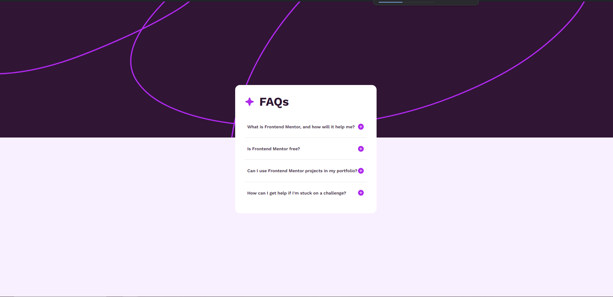
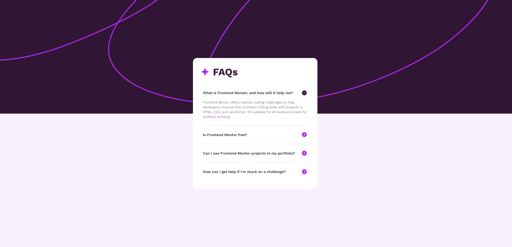
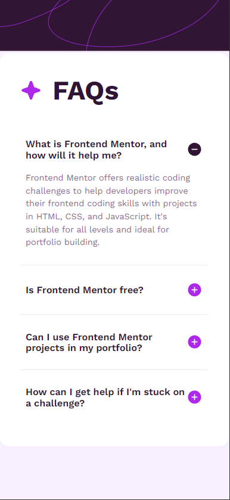

# Front end Mentor Challenge

Based on challenge in <a href="https://www.frontendmentor.io/challenges/recipe-page-KiTsR8QQKm">Here</a>

## Finished project

## Mobile View

## What i'm learning

<ul>
<li>
    HTML Structure
</li>
<li>
    CSS Styling
</li>
<li>
    Event Listeners (OnClick)
</li>
<li>
    Class Change by JS
</li>
</ul>

## Do you want to see?
<a href="https://65ceb24b1ee8145aca3c6a21--monumental-bonbon-189735.netlify.app/">Open Here :dart:</a>